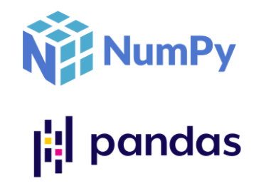
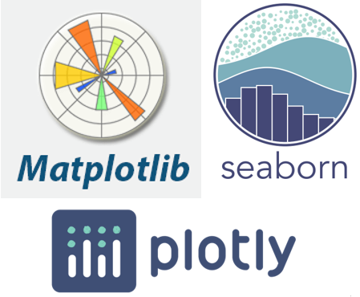

 
 
&nbsp;&nbsp;&nbsp;
 

## Welcome! This directory contains content, code & resources for the series **Python Libraries 101**.

*Clicking on a logo will take you to the event code base or slides. You will also find a link to the video recording in the event description. All of our events are uploaded to the [Women Who Code Youtube Channel](https://www.youtube.com/channel/UCfMEaBUSABoOsxr7HgSmEdA) 1-3 days following an event. Please reach out with any questions or issues, or join us in our Slack channel for interactive discussions and support.*

<table style= "background-color: transparent; border-color: transparent;">
<tbody>

<tr>
<td style="border: none;" align="left" width="20%"><a href="https://github.com/WomenWhoCode/WWCodePython/tree/master/Python%20Libraries%20Series/Python%20Standard%20Library">&nbsp;</td>
<td colspan="3"><b>The Python Standard Library</b> 
    Explore different functions and variables offered by Python's built-in modules. 

    
<em>- By Soumya Vemuri, Shermaine Ang and Karen Wong </em></td>
</tr>

<tr>
<td style="border: none;" align="left" width="20%"><a href="https://github.com/WomenWhoCode/WWCodePython/tree/master/Python%20Libraries%20Series/Data%20Science%20Foundations">&nbsp;</td>
<td colspan="3"><b>Data Science Foundations</b> 
    Explore fundamental Python libraries used in Data Science - Numpy and Pandas. 

    
<em>- By Karen Wong </em></td>
</tr>

<tr>
<td style="border: none;" align="left" width="20%"><a href="https://github.com/WomenWhoCode/WWCodePython/tree/master/Python%20Libraries%20Series/Data%20Visualization">&nbsp;</td>
<td colspan="3"><b>Data Visualization</b> 
    Walkthrough various Data Visualization libraries offered by Python - Matplotlib, Seaborn and Plotly. 

    
<em>- By Soumya Vemuri, Shermaine Ang and Karen Wong </em></td>
</tr>

<tr>
<td style="border: none;" align="left" width="20%"><a href="https://github.com/WomenWhoCode/WWCodePython/tree/master/Python%20Libraries%20Series/Graphical%20User%20Interfaces">&nbsp;</td>
<td colspan="3"><b>Graphical User Interfaces</b> 
    Building cross-platform, stable, and easy-to-learn Graphical User Interfaces using Python's Tkinter! 

    
<em>- By Soumya Vemuri</em></td>
</tr>

