 
 
&nbsp;&nbsp;&nbsp;
 

Welcome! This repo contains content, code, and resources for the Women Who Code Python Global Track Events.

The Python track provides tutorials and resources to help and inspire women to excel in careers that use the Python programming language.

💻 Technical Webinars 📲 Coding Resources 💭 Study Group Sessions 🗺️ Supportive Global Network

**If you're interested in joining the community as a member or volunteer, please visit our [website](https://www.womenwhocode.com/python) for more information! Or send us an [email](python@womenwhocode.com).**

## Social

Join our community conversations!

[Slack](https://join.slack.com/t/wwcodepython/shared_invite/zt-m361di68-03G9V7OpYxW8nCSXC9n4WA)  
[Twitter](https://twitter.com/WWCodePython)  
[LinkedIn](https://www.linkedin.com/showcase/women-who-code-python)  
[Instagram](https://www.instagram.com/wwcodepython/)  
[Facebook](https://www.facebook.com/WWCodePython)  

## Event Resources

Expand the section below to find all the resources shared during past and upcoming events. Clicking on a logo will take you to the event code base and/or slides. You will also find a link to the video recording in the event description. All of our events are uploaded to the [Women Who Code Youtube Channel](https://www.youtube.com/playlist?list=PLVcEZG2JPVhd8nd_UOjOkocVn_5u_YrcD) 1-7 days following an event. Please reach out with any questions or issues, and join us on Slack for interactive discussions and support.

To add new resources for events, follow the [CONTRIBUTING guidelines](ContributingGuidelines.md).

<table style= "background-color: transparent; border-color: transparent;">
<tbody>

  <tr>
<td colspan="4"><h3> <em>Clicking on a logo below will take you to the associated repo -- where you can review, copy or clone the repo's content.  Please reach out with any questions or issues, and/or join us on Slack for interactive discussions and support.</em>  </h3></td>
</tr>

<!-- Introduction to Coding Environments for Python -->
<tr>
<td style="border: none;" align="left" width="20%"><a href="https://github.com/jessicakoubi/wwcode_pyton_ide_series.git">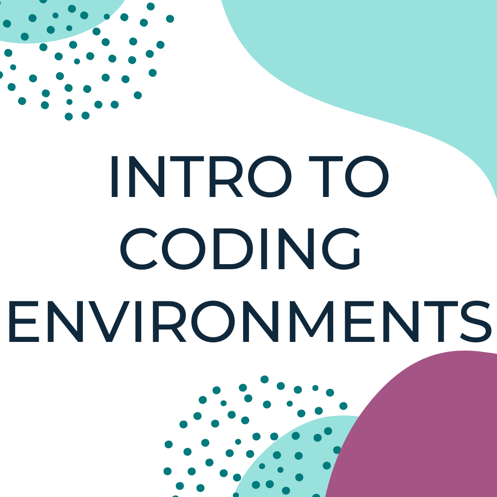&nbsp;</td>
<td colspan="3"><b>Introduction to Coding Environments for Python</b>
    
Jupyter. Visual Studio Code. PyCharm. Confused about which IDE or code/text editor to use for your next Python project? Want to know the differences between IDE's and code/text editors? Not to worry! We have you covered!

Join us for an exciting series that will introduce you to some of the popular coding environments used for Python, including: Google Colab, Jupyter notebooks, Visual Studio Code, PyCharm, Vim, Anaconda, and more!
    
<em>- By Poojita Garg, Jessica Koubi and Nayeon Shin</em></td>
</tr>

<!-- Introduction to Qt -->
<tr>
<td style="border: none;" align="left" width="20%"><a href="https://github.com/jessicakoubi/talk_introduction_to_qt">&nbsp;</td>
<td colspan="3"><b>Introduction to Qt</b>
    
Do you have a cool application idea or want to distribute your tools to non-technical users?

Join our Introduction to Qt series to learn how to create your first interface with PyQt/PySide! We will go over how to create simple interfaces, some of Qt concepts, and how to put everything together to create a more complex interface.
    
<em>- By Jessica Koubi </em></td>
</tr>

<!-- OneLineCoding -->
<tr>

<td style="border: none;" align="left" width="20%"><a href="https://github.com/WomenWhoCode/WWCodePython/tree/master/OneLineCoding">&nbsp;</td>
<td colspan="3"><b>Less Is More: How to Code Python in One Line</b>
  

These Python one-liners will save you a bunch of time on your next project, so make sure to come along with us on this journey to uncover the true potential of the Python language and learn how to✨ do a lot with a little✨.
    
<em>- By Poojita Garg and Karen Wong </em></td>
</tr>

<!-- Leetcode -->
<tr>

<td style="border: none;" align="left" width="20%"><a href="https://github.com/WomenWhoCode/WWCodePython/tree/master/LeetCodeSeries">&nbsp;</td>
<td colspan="3"><b>LeetCode Study Group</b>
    
In this study group we will be walking through a medium level LeetCode problem from understanding the problem to solving it. We will discuss one pattern during each session.
    
<em>- By Chethana Gopinath and Karen Wong </em></td>
</tr>

<!-- Library 101 -->
<tr>
<td style="border: none;" align="left" width="20%"><a href="https://github.com/WomenWhoCode/WWCodePython/tree/master/Python%20Libraries%20Series">&nbsp;</td>
<td colspan="3"><b>Python Libraries 101 Study Group</b>
    
This study group will journey through the exciting world of Python libraries to help you code faster, better and smarter!
    
<em>- By Soumya Vemuri, Shermaine Ang and Karen Wong </em></td>
</tr>

<!-- Coding for Movie Industry -->
<tr>
<td style="border: none;" align="left" width="20%"><a href="https://github.com/jessicakoubi/talk_coding_for_the_movie_industry">&nbsp;</td>
<td colspan="3"><b>May the Pipeline Be with You: Coding for the Movie Industry</b>
    
This talk will introduce you to the role of a Pipeline Technical Director in the VFX/Animation industry. We will go over who works as Pipeline TD, which kind of software development is done in the movie industry, and finally, we will look at some of the tools developed for Avengers: Infinity War.
    
<em>- By Jessica Koubi and Bushra Alma </em></td>
</tr>

<!-- Trivia Tuesday -->
<tr>
<td style="border: none;" align="left" width="20%"><a href="https://github.com/jessicakoubi/wwc_python_trivia_tuesday">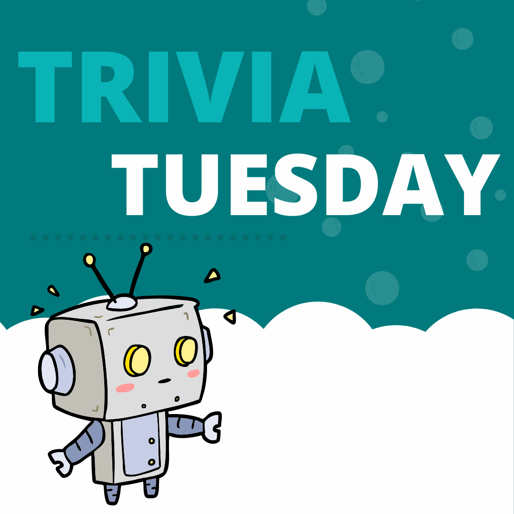&nbsp;</td>
<td colspan="3"><b>Trivia Tuesday</b>
    
Stay tuned every Tuesday on our Instagram, Twitter, and LinkedIn page for a new Trivia Tuesday.
    
<em>- By Jessica Koubi </em></td>
</tr>

<tr>
<td style="border: none;" align="left" width="20%"><a href="https://github.com/tinyml-team/study-group">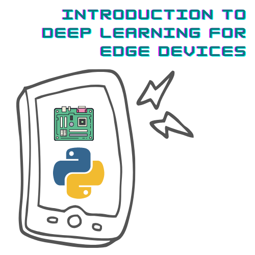&nbsp;</td>
<td colspan="3"><b>Introduction to Deep Learning for Edge Devices</b>
    
In this session we go through the basics of deep learning for edge computing.
Session 1: Introduction to Edge Computing
Session 2: Basics of Running Neural Network at the Edge
Session 3: Quantization of Neural Networks
Session 4: Hardware for the Edge
Session 5: Pruning
Session 6: Early Exits for Neural Network
Session 7: Edge TPU and Edge TPU Accelerator
    
<em>- By Vaidheeswaran Archana and Soham Chatterjee </em></td>
</tr>

<tr>
<td style="border: none;" align="left" width="20%"><a href="https://github.com/HalaSaadeh/womenwhocode-python-databases-series">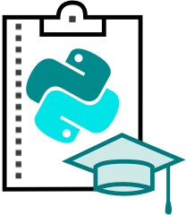&nbsp;</td>
<td colspan="3"><b>Databases with Python: Quickstart: An Overview of SQL - Concepts, Structure, and More</b>
    
With a world so centered around data, databases are an essential component for every developer. Python has a series of tools and libraries that help us manipulate and work with databases using our Python code.
In this series, we will be exploring the concepts, theory, and code behind multiple databases, both SQL and noSQL. The series will kickstart with a session on SQL concepts where we will tackle relational databases from A-Z. Then, we will use SQL with Python, and following that, we will jump to noSQL and explore two very popular databases, MonogoDB and Firebase.
    
<em>- By Hala Saadeh, Ramya, and Karen Wong </em></td>
</tr>

<tr>
<td style="border: none;" align="left" width="20%"><a href="https://github.com/WomenWhoCode/WWCodePython/tree/master/DataStructuresseries">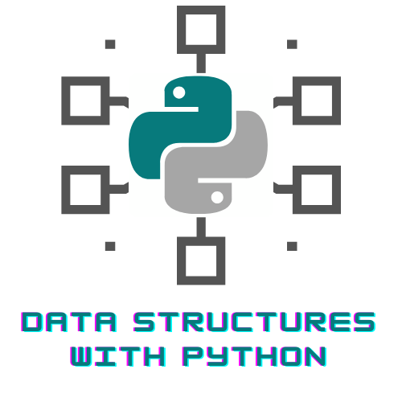&nbsp;</td>
<td colspan="3"><b>Introduction to Data Structures with Python: Ace the Technical Interview</b>
    
This study group will cover the various sub-types of data structures and specifically implementing them in Python. Each session will begin with a conceptual presentation and conclude with a live-coding implementation using Google Colab.
    
<em>- By Rishika Singh and Jasmeen Rajpal</em></td>
</tr>

<tr>
<td style="border: none;" align="left" width="20%"><a href="https://github.com/google/python-fire">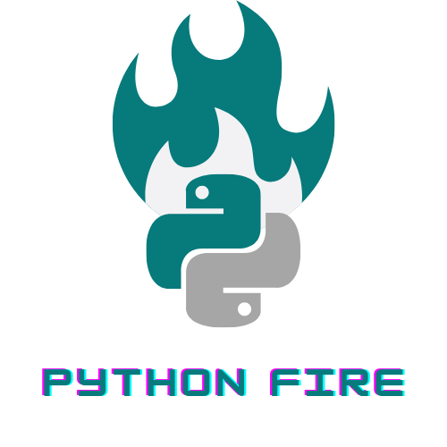&nbsp;</td>
<td colspan="3"><b>Python Fire</b>
    
Python Fire is a library for automatically generating command-line interfaces (CLIs) from absolutely any Python object.
Python Fire got its name Fire because when you call `Fire`, it fires off (executes) your command.
Learn about:
- What exactly is Python Fire?
- How Python Fire can make your code concise?
- Where and when to use Python Fire?
- How to contribute to the library and make it more awesome?
    
<em>- By David Beiber</em></td>
</tr>

<tr>
<td style="border: none;" align="left" width="20%"><a href="https://github.com/rishikasb/DiscoverNLPwithPython">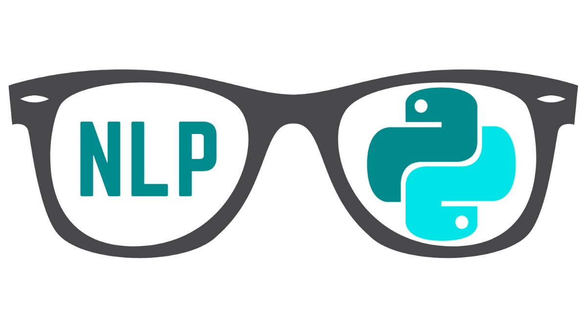&nbsp;</td>
<td colspan="3"><b>Discover NLP with Python Study Group</b>
    
Please join us in discovering NLP with Python, as we begin with the foundations of NLP and deep learning, all the way to its applications in machine translation and sentiment analysis. Our monthly sessions will introduce you to the exciting world of natural language processing!
    
<em>- By Yashika, Rishika, and Ramya</em></td>
</tr>

<tr>
<td style="border: none;" align="left" width="20%"><a href="https://github.com/mridubhatnagar/vocabbot">&nbsp;</td>
<td colspan="3"><b>Building a Bot for WhatsApp Using Python and Flask</b>
    
Mridu is back with a follow up event on using Flask for creation of vocabulary bot on whatsapp!
In this webinar you will learn about a Brief introduction to Flask and Building a WhatsApp Bot using Twilio and Python.
    
<em>- By Mridu Bhatnagar</em></td>
</tr>

<tr>
<td style="border: none;" align="left" width="20%"><a href="https://github.com/SaraM92/Intro-to-QC">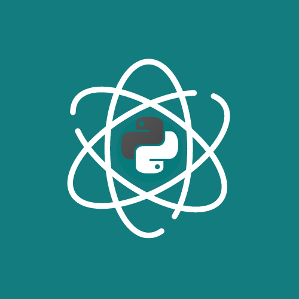&nbsp;</td>
<td colspan="3"><b>Introduction to Quantum Computing Programming with Python and Qiskit</b>
    
In this webinar we explore the basics of quantum computing, such as qubits, superposition, entaglment and quantum gates. We navigate options to program a quantum computer and build our first circuit on a simulator and using code.
    
<em>- By Sara A. Metwalli</em></td>
</tr>

<tr>
<td style="border: none;" align="left" width="20%"><a href="https://github.com/nuageklow/WWCodePython_BeginnerSeries">&nbsp;</td>
<td colspan="3"><b>Beginner Python Study Group 2020</b>
    
Join us every other Wednesday at 5PM PDT/8PM EDT as we journey through the exciting world of Python libraries, data types, programming logic and useful functions, and modules with real-time coding exercises. Grab a cup of tea (or your favorite drink) and code along with us!
    
<em>- By Rishika Singh, Karen Wong, and Stephanie Rideout</em></td>
</tr>

<tr>
<td style="border: none;" align="left" width="20%"><a href="https://github.com/seema1711?before=Y3Vyc29yOnYyOpK5MjAyMC0wNC0yN1QxMzozNTo1OSswOTowMM4PgXaH&tab=repositories">&nbsp;</td>
<td colspan="3"><b>Build Bots on Twitter Bot using Python</b>
    
 This is the era of automation, we see everything is automated in the Tech World, whether you don't know how it's done. Python is the language that is widely used for this purpose. Here in this talk, we will build a twitter bot in less than 30 lines of code, that will like, and retweet a particular keyword's tweet.
    
<em>- By Seema Saharan</em></td>
</tr>

<tr>
<td style="border: none;" align="left" width="20%"><a href="https://docs.google.com/presentation/d/1S9uxiGG8amckIp5J2jkbXFrv7c9RgcIf0fdc18hmeBw/edit?usp=sharing">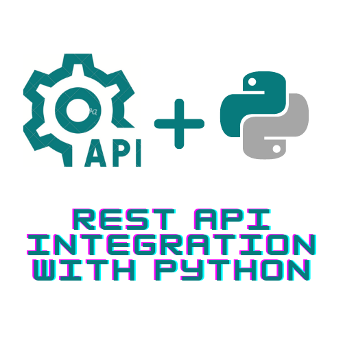&nbsp;</td>
<td colspan="3"><b>REST API Integration with Python</b>
    
Rest APIs are the backbone of Microservices. All major websites and many software services use Rest APIs to transfer data.
But how do you use this API to communicate with the Web?
    
<em>- By Mridu Bhatnagar</em></td>
</tr>

<tr>
<td style="border: none;" align="left" width="20%"><a href="https://github.com/womenwhocoderichmond/DataPy-CI-Pipeline">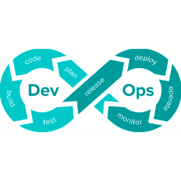&nbsp;</td>
<td colspan="3"><b>Python and DevOps </b>
    
This webinar will break down and explore python and CICD (continuous integration , continuous deployment).  Participants will learn how to implement Continuous Integration for a Python application. They will also see how to deploy an application on AWS using Python/Boto3.
    
<em>- By Viji Natarajan</em></td>
</tr>

<tr>
<td style="border: none;" align="left" width="20%"><a href="https://github.com/Mariatta/github-app-tutorial">&nbsp;</td>
<td colspan="3"><b>Build a GitHub-Bot Workshop</b>
    
 In this workshop we’ll be building a GitHub bot that will greet contributors to your project. The bot will be built as a GitHub App which can then be installed to your GitHub repositories.
We will be building a GitHub bot that can say thanks to the maintainer who installed your bot using gidgethub and aiohttp libraries.
If time permits, I'll also share how you can automate other parts of your workflow with Zapier.
    
<em>- By Mariatta Wijaya</em></td>
</tr>

<tr>
<td style="border: none;" align="left" width="20%"><a href="https://github.com/jiaqi216/fuzzy-search-talk">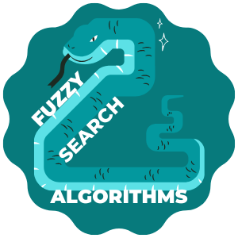&nbsp;</td>
<td colspan="3"><b>Fuzzy Search Algorithms: When and How to Use Them</b>
    
Fuzzy Searching or approximate string matching is powerful because often text data is messy. For example, shorthand and abbreviated text are common in various data sets. In addition, outputs from OCR or voice to text conversions tend to be messy or imperfect. Thus, we want to be able to make the most of our data by extrapolating as much information as possible.
In this talk, we will explore the various approaches used in fuzzy string matching and demonstrate how they can be used as a feature in a model or a component in your python code. We will dive deep into the approaches of different algorithms such as Soundex, Trigram/n-gram search, and Levenshtein distances and what the best use cases are. We will also discuss situations where it’s important to take into account the meaning or intent of a word and demonstrate approaches for measuring semantic similarity using nltk and word2vec. Furthermore, we will demonstrate via live coding how to implement some of these fuzzy search algorithms using python and/or built-in fuzzy search functions within PostgreSQL.
    
<em>- By Jiaqi Liu</em></td>
</tr>

<tr>
<td style="border: none;" align="left" width="20%"><a href="https://github.com/ShreyaKhurana/wwc/tree/master">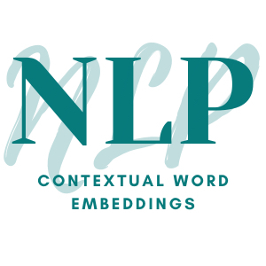&nbsp;</td>
<td colspan="3"><b>NLP Contextual Word Embeddings</b>
    
Language representations and embeddings are an important step in developing machine learning models for Natural Language Processing. They are used for various language problems - Named entity recognition, POS tagging, sentiment analysis or language understanding and generation.

While traditional encodings to convert words and sentences to vectors were more intuitive, static embeddings were developed to incorporate a large vocabulary and corpus and eliminating the problem of sparse vectors. Since then, we’ve seen methods like word2vec, GloVe and now contextual embeddings are the norm - Elmo and now the state-of-the-art BERT.

In this talk, we’ll be covering how to create these embeddings with a focus on the most recent development - BERT, using the HuggingFace Transformers Library. We shall also cover how we can obtain BERT multilingual embeddings and how these embeddings are useful in a seq2seq network - which is a specific type of neural architecture to convert sequence of words or characters to another sequence
    
<em>- By Shreya Khurana</em></td>
</tr>

<tr>
<td style="border: none;" align="left" width="20%"><a href="https://github.com/AndyLPK247/tau-intro-selenium-py">&nbsp;</td>
<td colspan="3"><b>Beyond Unit Tests: End to End Web UI Testing  (or <i>Testing Google forms, and how much I hate it</i>)</b>
    

Unit tests are great, but they don’t catch all bugs because they don’t test features like a user -- but Web UI tests are complicated & notoriously unreliable. How can we write tests that do the job well? Never fear! :star2: :star2: :star2:

Let’s learn how to write robust, scalable Web UI tests using Python, pytest, & Selenium WebDriver that cover the full stack for **any** Web app:

- Using Selenium WebDriver like a pro
- Modeling Web UI interactions in Python code
- Writing “good” feature tests that are efficient, robust, and readable
- Deciding what should and should not be tested with automation

In this talk, we'll write one simple test together that covers DuckDuckGo searching.  Afterwards, you’ll know how to write battle-hardened Web UI tests for **any** Web app, including Django & Flask apps. Example code will be supplied on GitHub, as well as plenty of hands-on tutorials & resources to continue learning!
    
<em>- By Andrew Knight</em></td>
</tr>

<tr>
<td style="border: none;" align="left" width="20%"><a href="https://github.com/parulnith/Elements-of-Functional-Programming-in-Python">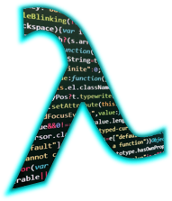&nbsp;</td>
<td colspan="3"><b>Programming with Lambda, Map, Filter & Reduce</b>
    

Most of the time, Python is seen as **object-oriented** -- a style where we model our data in the form of **classes**, **objects**, & **methods**.  But Python supports alternatives to that **OOP** paradigm -- **Functional Programming** being a very popular choice.  

Functions like **lambda** , **filter**,  **map**,  &  **reduce** fully support the Functional Programming style & in this live coding session we'll demonstrate how they can be effectively & efficiently used in our data analysis tasks.

**Here are some good reads on Functional Programming, to get your started :**

1. [**Don't be Scared of Functional Programming**](https://www.smashingmagazine.com/2014/07/dont-be-scared-of-functional-programming/)
2. [**Functional Programming (Python Docs)**](https://docs.python.org/3.7/howto/functional.html)
    
<em>- By Parul Pandey</em></td>

</tr>

<tr>
<td style="border: none;" align="left" width="20%"><a href="https://github.com/SteeleAlloy/edaworkshop">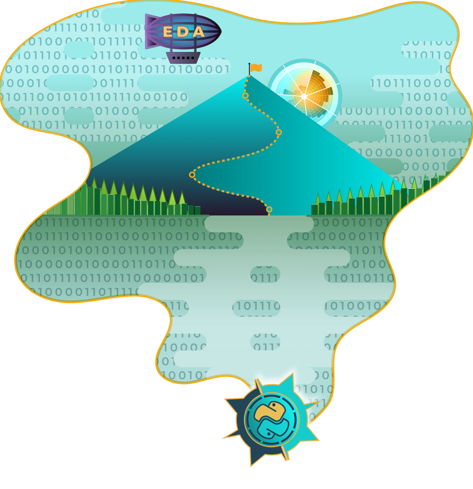&nbsp;</td>
<td colspan="3"><b>I've Got the Data, Now What?</b>
   
  <em>Exploratory Data Analysis(EDA) with Python & Pandas</em>  
    
  
Have you ever started a data science project and not known what to do next? Are you just curious about what a data scientist <em>actually</em> spends most of their time doing?   Join us to learn all about Exploratory Data Analysis <b>(EDA)</b> - the process of cleaning, organizing, & understanding your data.   During this talk we'll be covering how to import & organize data with pandas, make beautiful visualizations using Seaborn, & use some core Python as well! 🌟
    
<em>- By Ashley Steele</em></td>
</tr>

<tr>
<td style="border: none;" align="left" width="20%"><a href="https://colab.research.google.com/drive/1NcSbNMgjMFqEl64qA0fmpRX7IrHuUx3u">
  <a href="https://colab.research.google.com/drive/1T3bimqE9-OX4gSW4Zfjo3HjI-xPXBdK9">
  <a href="https://colab.research.google.com/drive/1T3bimqE9-OX4gSW4Zfjo3HjI-xPXBdK9">
  </td>

<td colspan="3"> <b>ETL Made Simple with PySpark</b>  
Apache Spark is currently one of the most popular systems for large-scale data processing - making it a standard for any developer or data scientist interested in big data. Spark supports multiple widely used programming languages(Scala, Python, R, Java) and a wealth of built-in and third-party libraries.

 

In <b>Session I</b> you will be introduced to Apache Spark main concepts & you'll learn how to leverage the DataFrame API to extract data. You will also learn how to connect to different sources, apply schemas when reading data, and handle corrupt records.  

<b>PART I:</b>     

In <b>session II</b> you will be introduced to some of the most useful transformations - adding new columns, casting column types, renaming columns, etc. You'll also learn how to define User Defined Functions to do your own custom transformations & a get a little introduction to executing your own ad hoc SQL!

<b>PART II:</b>     

In <b>session III</b> you'll analyze the robberies data by doing some aggregations & sorting. You'll learn how to convert Spark DataFrames to Pandas DataFrames. Additionally, you'll explore joins & lookup tables & write final results to CSV files. At the end of this session we'll go over best practices.

<b>PART III:</b>  

<em>- By Aida Martinez</em>  

</td>  
</tr>

<tr>
<td style="border: none;" align="left" width="20%"><a href="https://github.com/WomenWhoCode/WWCodePython/tree/master/respiratory-buddy"> &nbsp;</td>
<td colspan="3"> <b>A Walk-through of Respiratory Buddy</b>
 

A Web Application helping Doctors & medical personnel detect & diagnose Respiratory/Lung Diseases using CXR <i>(X-Ray data)</i> images.    A  Strictly Medical Machine-Learning based solution with a special implementation of a CNN <i>(convolutional neural network)</i>.

<em>- by Vishwa Mehta</em>
</tr>

<tr>
<td style="border: none;" align="left" width="20%"><a href="https://github.com/yashika51/Get-Started-with-NumPy/tree/f5760faa734b369757864f1e192e2813e4391c12">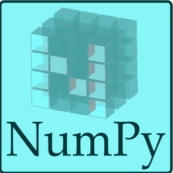 &nbsp;</td>
<td colspan="3"> <b>Getting Started with Numpy</b>
 

Python, data, matrices, transformations & all things Numpy!  Join Yashika as she covers the basics of this powerful & essential Data Science library that underpins Pandas, Matplotlib, Seaborn, & many many others.

<em>- by Yashika Sharma</em>

<tr>
<td style="border: none;" align="left" width="20%"><a href="https://github.com/alexg-171/emoji_predictor/tree/0fa6058e70471a4dd969599ccbc039f07aa682dc"> &nbsp;</td>
<td colspan="3"> <b>✨Emoji Predictor with Machine Learning✨</b>
  

Python:exclamation:Python:exclamation:Python:exclamation:
   
Let me show you how to use SciKit to do an Emoji :laughing: :open_mouth: :grin: Predictor with a little Machine Learning  & Python. 🌈 Learn a few ML & NLP (Natural Language Processing) core concepts ........<em>We do it because we <b>can</b>.:star:</em>

<em>- by Alex Gamez, Software Engineer @ Lockheed Martin Aeronautics :rocket:</em>

  

<tr>

<tr>
<td style="border: none;" align="left" width="20%"><a href="https://github.com/liliana3186/DataManipulationPandas/tree/a1d964b18f9540058ba2c6884baba26b60abee88">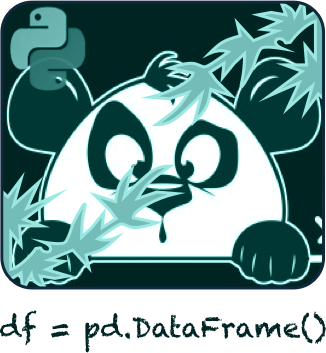 &nbsp;</td>
<td colspan="3"> <b>Data Manipulation with Python Pandas.</b> 
Come study all the delightful data and play with Pandas!   <em>Increase your Python data manipulation skills for fun and profit.
- By Liliana Torres</em>

  

<tr>
<td style="border: none;" align="left" width="20%"><a href="https://github.com/kunal-lalwani/WWC-Python-Webinar-Titanic/tree/67c3742090a729a816b52d2114df727b18026017">&nbsp;</td>
<td colspan="3">
<P?> <b>Titanic Machine Learning webinar 7/30/2019</b>  
<em>Do you want to rank in the top 10% in a Kaggle Competition?</em> Explore the Titanic Dataset & get a taste of Exploratory Analysis & Machine Learning Prediction with Python.
 <em>- By Kunal Lalwani</em>

  

<a href="https://thenounproject.com/search/?q=Titanic&i=731183"><b>Titanic Icon</b></a><b> by Anbileru Adaleru, </b> from The Noun Project. <a href="https://thenounproject.com"><b>thenounproject.com</b></em>  
</td>
</tr>

<tr>
<td style="border: none;" align="left" width="20%"><a href="https://github.com/iris9112/WWCode-python/tree/a80034439d918866d1a27c9bba429a9281fe481c">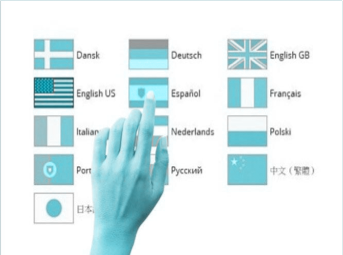&nbsp;</td>
<td colspan="3"> <b>Taller Internacionalización con Django 7/24/2019</b>  
Aprende los conceptos relacionados con la internacionalización de aplicaciones web con ejemplo traducción del contenido estatico y dinamico de un sitio web.
 <em>- Por Isabel Cristina Ruiz Buritica</em></td>
</tr>

<tr>
<td style="border: none;" align="left" width="20%"><a href="https://github.com/GabrielleRab/PyCon_2019/tree/a2572354d56e6489cf5785e63f3a0a161c5ccc92">&nbsp;</td>
<td colspan="3"> <b>Using Jupyter, Pandas & Matplotlib: PyCon 2019  <em>(re-broadcast 7/02/2019)</em></b> 
Using Jupyter Notebook, Pandas, and Matplotlib to create a framework for teaching data science in a scientific context.  Download the presentation and resources here.
 <em>- By Gabrielle Rabinowitz</em>
</td>
</tr>

<tr>
<td style="border: none;" align="left" width="20%"><a href="https://github.com/BethanyG/ML_Mondays_WWCodePython">&nbsp;</td>
<td colspan="3"><b>ML Mondays</b>  
Join us alternating <b>Mondays</b> for a wholesome & healthy dose of <b>ML 🌟</b>.  -- Starting off with a whirlwind review of Python & then diving into foundational libraries.  
    
We'll also be discussing the ideas behind ML and covering a little ✨math & statistics✨🎉.  As we journey further along, we'll collaborate & help one another with projects & other fun 🔥 stuff.
<em>- By Yashika Sharma</em></td>
</tr>

<tr>
<td style="border: none;" align="left" width="20%"><a href="https://github.com/BethanyG/WWCodePythonAutomate_the_Snippets">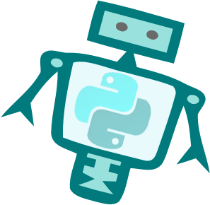&nbsp;</td>
<td colspan="3"><b>Automate Boring Stuff</b>  
<a href="https://automatetheboringstuff.com/"> Automate the Boring Stuff With Python</a>:  &nbsp; A friendly forum where we can ask questions, provide feedback & help each other with our coding journey. <em>Explore our code & notes for each chapter here!
- By Jamila Evilsizor</em></td>
</tr>

</tbody>
</table>

&nbsp;
&nbsp;
&nbsp;

<a href="https://www.womenwhocode.com/python/about">
