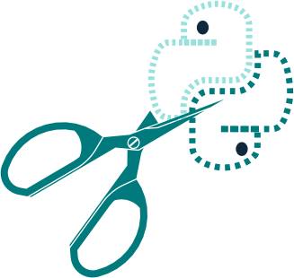
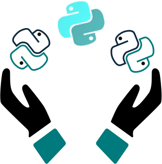

 
 
&nbsp;&nbsp;&nbsp;
 

<table style= "background-color: transparent; border-color: transparent;">
<tbody>
  
<tr>
<td colspan="4"><h3> <em>Clicking on a logo below will take you to the associated repo -- where you can review, copy or clone the repos content.  Please reach out with any questions or issues, or join us in our Slack channel for interactive discussions and support.</em>  </h3></td>
</tr>

<tr>
<td style="border: none;" align="left" width="20%"><a href="https://github.com/BethanyG/WWCodePythonAutomate_the_Snippets">&nbsp;</td>
<td colspan="3"><b>Automate Boring Stuff</b>  
Join us <b>Thursdays</b> to discuss <a href="https://automatetheboringstuff.com/"> Automate the Boring Stuff With Python</a>:  &nbsp; A friendly forum where we can ask questions, provide feedback & help each other with our coding journey. <em>Explore our code & notes for each chapter here!
- By Jamila Evilsizor</em></td>
</tr>

<tr>
<td style="border: none;" align="left" width="20%"><a href="https://github.com/alexg-171/emoji_predictor/tree/0fa6058e70471a4dd969599ccbc039f07aa682dc"> &nbsp;</td>
<td colspan="3"> <b>✨Emoji Predictor with Machine Learning✨</b> 
  

Python:exclamation:Python:exclamation:Python:exclamation:
   
Let me show you how to use SciKit to do an Emoji :laughing: :open_mouth: :grin: Predictor with a little Machine Learning  & Python. 🌈 Learn a few ML & NLP (Natural Language Processing) core concepts ........<em>We do it because we <b>can</b>.:star:</em>

<em>- by Alex Gamez, Software Engineer @ Lockheed Martin Aeronautics :rocket:</em>

  

<tr>
  
<tr>
<td style="border: none;" align="left" width="20%"><a href="https://github.com/liliana3186/DataManipulationPandas/tree/9e9979f5c8033021f725fa2939300a80a68f4a08"> &nbsp;</td>
<td colspan="3"> <b>Data Manipulation with Python Pandas.</b> 
Come study all the delightful data and play with Pandas!   <em>Increase your Python data manipulation skills for fun and profit.
- By Liliana Torres</em>

  

<tr>
<td style="border: none;" align="left" width="20%"><a href="https://github.com/SaraM92/Py-Snippets/tree/e2f190e7407fa2b8ede20a67a501d53c4975a865">&nbsp;</td>
<td colspan="3"> <b>Python Snippets</b>  
Check out our amazing & useful code examples.   <em>Increase your Python skills here!
- By Sara A. Metwalli</em>

 
  

<em>
<a href="https://thenounproject.com/marialuisa.iborra/collection/scissors/?i=1999145#"><b>Scissors Icon</b></a><b> by Lluisa Iborra, </b> from The Noun Project. <a href="https://thenounproject.com"><b>thenounproject.com</b></em>  
</td>
</tr>

<tr>
<td style="border: none;" align="left" width="20%"><a href="https://github.com/kunal-lalwani/WWC-Python-Webinar-Titanic/tree/67c3742090a729a816b52d2114df727b18026017">&nbsp;</td>
<td colspan="3">
<P?> <b>Titanic Machine Learning webinar 7/30/2019</b>  
<em>Do you want to rank in the top 10% in a Kaggle Competition?</em> Explore the Titanic Dataset & get a taste of Exploratory Analysis & Machine Learning Prediction with Python.
 <em>- By Kunal Lalwani</em>

  

<a href="https://thenounproject.com/search/?q=Titanic&i=731183"><b>Titanic Icon</b></a><b> by Anbileru Adaleru, </b> from The Noun Project. <a href="https://thenounproject.com"><b>thenounproject.com</b></em>  
</td>
</tr>

<tr>
<td style="border: none;" align="left" width="20%"><a href="https://github.com/iris9112/WWCode-python/tree/a80034439d918866d1a27c9bba429a9281fe481c">&nbsp;</td>
<td colspan="3"> <b>Taller Internacionalización con Django 7/24/2019</b>  
Aprende los conceptos relacionados con la internacionalización de aplicaciones web con ejemplo traducción del contenido estatico y dinamico de un sitio web.
 <em>- Por Isabel Cristina Ruiz Buritica</em></td>
</tr>

<tr>
<td style="border: none;" align="left" width="20%"><a href="https://github.com/BethanyG/beginner_nights/tree/master/tictactoe">&nbsp;</td>
<td colspan="3"><b>Python Project Nights starting 7/16/2019</b> 
Explore beginner projects with code samples & warm-up exercises.
 <em>- By Bethany Garcia</em></td>
</tr>

<tr>
<td style="border: none;" align="left" width="20%"><a href="https://github.com/GabrielleRab/PyCon_2019/tree/a2572354d56e6489cf5785e63f3a0a161c5ccc92">&nbsp;</td>
<td colspan="3"> <b>Using Jupyter, Pandas & Matplotlib: PyCon 2019  <em>(re-broadcast 7/02/2019)</em></b> 
Using Jupyter Notebook, Pandas, and Matplotlib to create a framework for teaching data science in a scientific context.  Download the presentation and resources here.
 <em>- By Gabrielle Rabinowitz</em>
</td>
</tr>

</tbody>
</table>

&nbsp;
&nbsp;
&nbsp;

<a href="https://www.womenwhocode.com/python/about">

